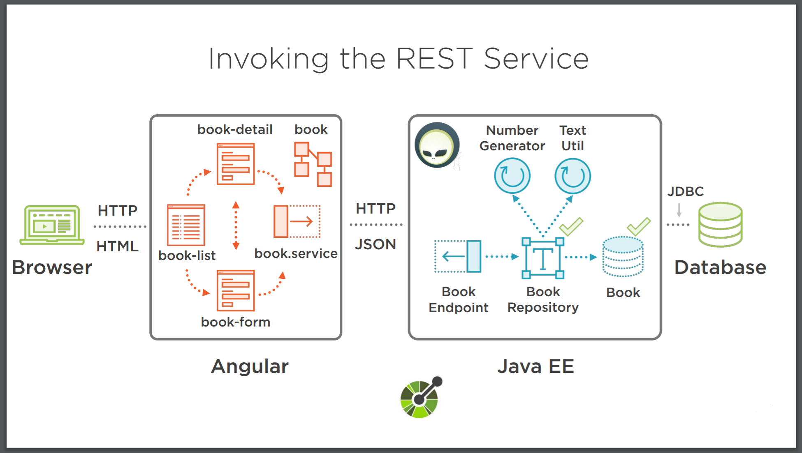

# Welcome to Bookstore

Bookstore is a simple project which is built using JEE 8 JAX-RS 
technology for the back-end and Angular 6 for the front-end. Its purpose is to provide
 the skeleton for a multi-tier application using JEE and Angular.
 
 ## Introduction
 
 This Project is an extension of the Project explained on **Pluralsight** by **Antonio Goncalves** [available here](https://app.pluralsight.com/player?course=java-ee-getting-started).
 
 
 
 ## Getting started
 
 The project contains a folder _.idea_ with all the required configurations to _Run_, _Test_, and _Package_
 both Front-end and Back-end. One ore more dependencies are required to run the project
 using the current configuration:
 
 - Arquillian
 - JBOSS WidlFly 13 or JBOSS EAP